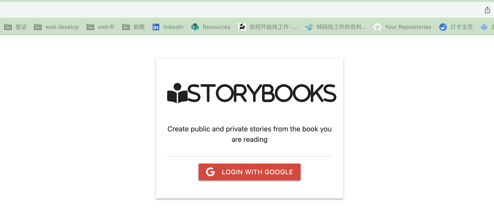

# StoryBooks

## Install dependencies + Express set up

## Connect database

1. store mongo uri in the config file

## Morgan Logger

when there is a request to the page, it just shows down the console

## Template Engine & Layouts

using handlebars

## Index Routes & Views

## Materialize & Font Awesome

grab CDN from https://materializecss.com/getting-started.html

## Login Layout

## Start Google Login & Passport

google console platform -> enable google+ api -> create credentials -> Oauth client ID
Passport-google-oauth20 (configure strategy + authenticate)
